# **Saber Scroll**

.png)

Wager your Jedi skills with the retro-design game Saber Scroll. Developed by Hackathon Team **Burgundy Lightsaber** during the May 2023 Hackathon.

Live deployment link can be found [here](https://amylour.github.io/star_wars_hackathon/).

# Table of Contents

1. [Project Goals](#project-goals "ProjectGoals")
2. [User Experience](#user-experience "User Experience")
   + [Target Audience](#target-audience "Target Audience")
   + [User Requirements and Expectations](#user-requirements-and-expectations "User Requirements and Expections")
   + [User Stories](#user-stories "User Stories")
3. [Design](#design "Design") 
   + [Design Choices](#design-choices "Design Choices")
   + [Colour](#colour "Colour")
   + [Fonts](#fonts "Fonts")
   + [Music & Sounds](#music--sounds "Music & Sounds")
   + [Wireframes](#wireframes "Wireframes")
4. [Technologies, Languages & Programs Used](#technologies-languages--programs-used)
5. [Features](#features "Features")
   + [Existing Features](#existing-features "Existing Features")
      + [Start Screen](#start-screen "Start Screen")
      + [Game Screen](#game-screen "Game Screen")
      + [End Screen](#end-screen "End Screen")
   + [Future Features](#future-features "Future Features")
6. [Testing](#testing "Testing")
   + [Bugs](#bugs "Bugs")
   + [Validator Testing](#validator-testing "Validator Testing") 
7. [Deployment, Development & Version Control](#deployment-development--version-control)
8. [Credits](#credits "Credits")

## **Project Goals**

Based on the Code Institute Hackathon May 2023 Theme of "May the 4th be with you", create a Star Wars-themed browser-platform game. The game should be fully functioning with as little bugs as possible, and playable by users of all ages. 

## **User Experience**

This game offers a level-based gaming experience where players can progress with win onto the next leveled adventure in the Star Wars universe. Several things can be expected from the game:

* **Star Wars Pop-Culture references:** Throughout the game, various pop-culture references can be understood by the user if they are a Star Wars fans. The use of lightsabers, clones, Darth Vader helmets as sprites, as well as the beautifully made retro backgrounds are a few examples of these references.

* **Controls:** The user is able to use the arrow keypad to move their lightsaber sprite and make smart, calculated decisions about where to move around the environment.

* **Progressive Challenge:** The player is brought between 3 levels, beginning with level 1, an easier, standard level, then to level 2, more moderate and finally to the 3rd level, which is significantly harder than the previous: thus the user is put under pressure and is challenged to be clever about their strategy.

* **Retro Environment:** Our team specifically chose to develop graphic designs based around a retro-themed environment. All the sprites, backgrounds, items, health containers and general features have been made in an attempt to give a "retro" feel to the application.

* **Immersive Sound:** Retro audio has been caringly added to the gaming environment so match the retro environment and immerse the player into their gaming experience.

## **Target Audience**

Our target audience is a range of absolutely any person that can use a computer, thus any user from a young age to senior.

## **User Stories**

#### **First time user**

* As a **first-time user**, I want **to see a landing page that features memorable Star Wars references and sound** so that I **immediately feel immersed in the Star Wars universe**.

* As a **first-time user**, I want **the landing page to be designed to load quickly and smoothly and to include interactive elements** so that I can **see the website is working to prepare the game for me to enjoy**.

* As a **first-time user**, I want **the loading page to smoothly transition into the main menu of the game when it has loaded**.

* As a **first-time user**, I want **to see the rules of the game** so that **I am clear with what I am doing**.

* As a **first-time user**, I want **to be able to control an audit playing** so that I can **be in control of the game**.

#### **Game Play**

* As a **first-time and returning-user**, I want **to be able to customise my character's lightsaber before starting the game**.

* As a **first-time**, I want **to be able to control my character's movement using the arrow keys and actions using the space-bar**.

* As a **first-time**, I want **to progress through the game accumulating the highest score possible with increasing difficulty** so that I **feel challenged and engaged**.

* As a **first-time**, I want **to have a set number of lives depicted by Yoda icons, which depreciate each time I make a mistake**.

* As a **user**, I want **to have opportunities to gain rewards during the game play, such as an extra life or bonus points for difficult to complete challenges**.

* As a **returning user**, I want **the game play to have a high level of replayability**.

* As a **returning user**, I want **the game to have multiplayer functionalities, such as competing for high scores with an interactive leaderboard or engaging in a local connection**.

#### **Developer**

* As a **developer**, I want **the game to be responsive and smooth to users' interactions on multiple devices (mobile and desktop)**.

* As a **developer**, I want **to ensure that the game's graphics and sound effects are immersive and engaging**.

## **Design**

### **Design Choices**

#### **_Components_**

The components of this project were inspired by classic pixel art and were painted in Procreate. 

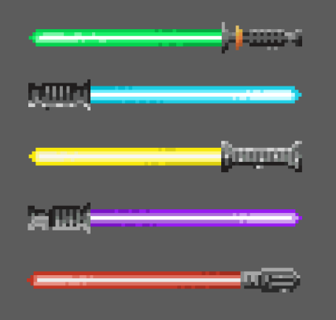 
_Lightsabers_
  
   

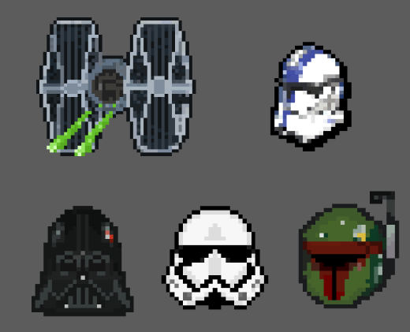 
_Baddies_
  
 

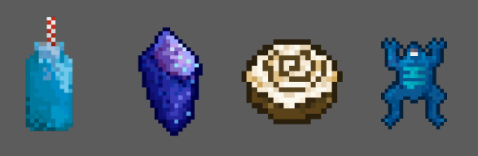 
_Snacks & Extra Lives_

 

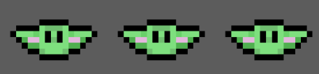 
_Lives_

 

#### **_Level Backgrounds_**

The backgrounds for this project were painted in Procreate. They have been inspired by classic pixel art and the Game Boy Advance game [Star Wars: Episode III - Revenge of the Sith](https://en.wikipedia.org/wiki/Star_Wars:_Episode_III_%E2%80%93_Revenge_of_the_Sith_(video_game))

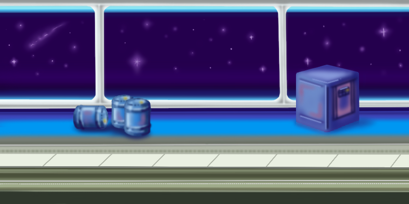 
_Level 1 - Death Star_
  

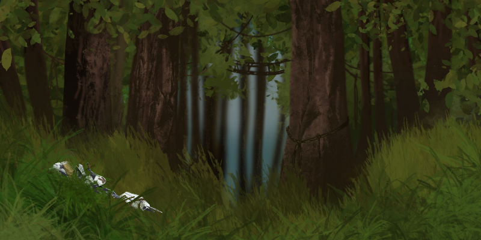 
_Level 2 - Endor_
  

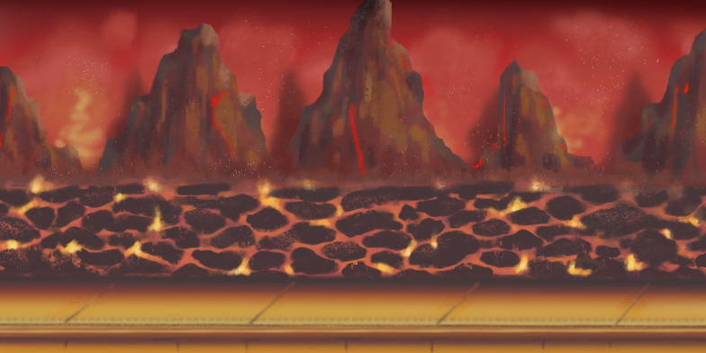 
_Level 3 - Mustafar_

### **Colour**

### **Fonts**

The fonts that we used were 'Noto Sans Display' from [Google Fonts](https://www.googlefonts.com) for the body text and 'SF Distant Galaxy' from [DaFont](https://www.dafont.com/sf-distant-galaxy.font)

### **Music & Sounds**

### **Wireframes**
Some basic wireframes were created so the team could be on the same page when creating the layout during coding sessions.

### **Landing page - Landscape**

### **Landing page - Portrait**
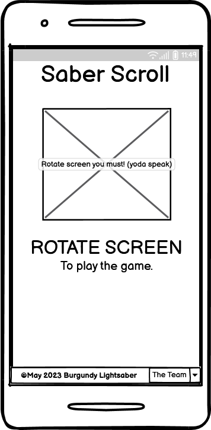

### **In Game Screen**
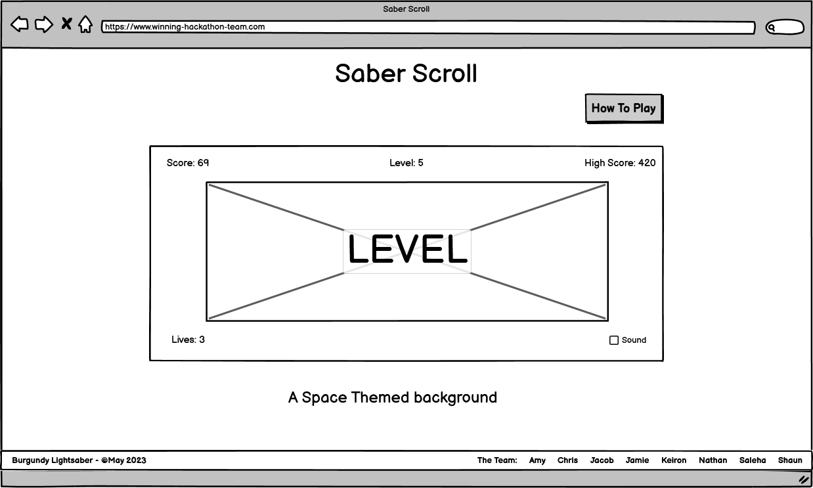

### **How To Play Screen**
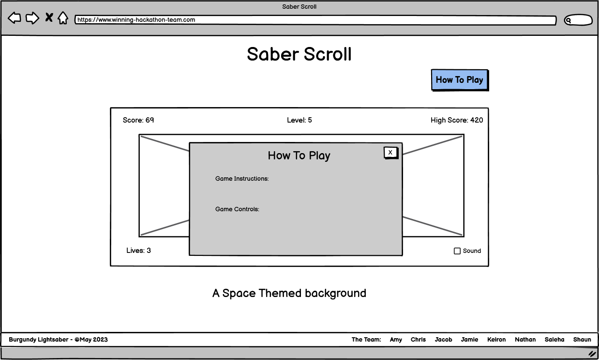

### **Game Over Screen**
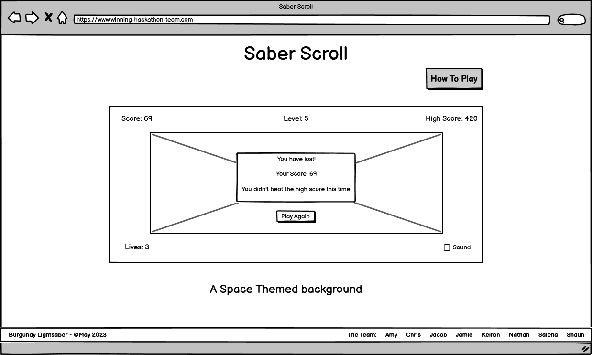

## **Technologies, Languages & Programs Used** 

- HTML, CSS + JavaScript 
- Procreate - used to create the Star Wars artwork and edit images 
- GitHub - used to save and store all files for this website  
- Git - used for version control
- Google Fonts - fonts were imported from here 
- Simple Image Resizer - to resize all artwork
- Tiny PNG - to compress images 
- Google Dev Tools - to debug and for testing responsiveness 
- Google Lighthouse - for auditing the website
- W3C Validator - for validating the HTML and CSS code 
- JSHint - for validating JavaScript

## **Features**

This game includes three pages:
 + Start Screen
 + Game Screen
 + End Screen

### **Existing Features**

### Start Screen

This is the first page that appears on the top of the screen the Saber Scroll image is added and then the welcome message with the rules of this Game. There is a button that enables user to start playing the game.

### Game Screen

When the user wants to play the game using the play button the game screen reveals. On the top of the screen the Saber scroll image is and a timer is added.
This page also includes footer. On the lift side of the page, copyright and link to GitHub page is added and on the right side the team members with a link to their GitHub pages are added.

### End Screen

This end screen reveals when the game overs. In this screen a button is added that if the user wanted to play the game again they can start playing again simply by clicking the play again button.

## **Testing**

## **Bugs**

## **Validator Testing**

## **Deployment, Development & Version Control**

## **Credits**

### **Media**

Any media acknowledgment here

### **Acknowledgments**

This project was created in collaboration by [Burgundy Lightsaber](https://hackathon.codeinstitute.net/teams/314/): Amy, Chris, Jacob, Jamie, Keiron, Saleha, Shaun

