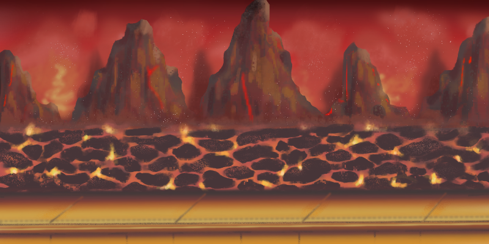

# **Saber Scroll**

## **Introduction**

# Table of Contents

1. [Project Goals](#project-goals "ProjectGoals")
   + [User Goals](#user-goals "User Goals")
2. [User Experience](#user-experience "User Experience")
   + [Target Audience](#target-audience "Target Audience")
   + [User Requirements and Expectations](#user-requirements-and-expectations "User Requirements and Expections")
   + [User Stories](#user-stories "User Stories")
3. [Design](#design "Design") 
   + [Design Choices](#design-choices "Design Choices")
   + [Colour](#colour "Colour")
   + [Fonts](#fonts "Fonts")
   + [Wireframes](#wireframes "Wireframes")
4. [Technologies, Languages & Programs Used](#technologies-languages--programs-used)
5. [Features](#features "Features")
   + [Existing Features](#existing-features "Existing Features")
      + [Start Screen](#start-screen "Start Screen")
      + [Game Screen](#game-screen "Game Screen")
      + [End Screen](#end-screen "End Screen")
   + [Future Features](#future-features "Future Features")
6. [Testing](#testing "Testing")
   + [Bugs](#bugs "Bugs")
   + [Validator Testing](#validator-testing "Validator Testing") 
7. [Deployment, Development & Version Control](#deployment-development--version-control)
8. [Credits](#credits "Credits")

## **Project Goals**

### **User Goals**

## **User Experience**

### **Target Audience**

### **User Requirements and Expectations**

### **User Stories**

#### **First time user**
* As a first-time user, I want to see a landing page that features memorable Star Wars references and sound so that I immediately feel immersed in the Star Wars universe.
* As a first-time, I want the landing page to be designed to load quickly and smoothly and to include interactive elements so that I can see the website is working to prepare the game for me to enjoy.
* As a first-time, I want the loading page to smoothly transition into the main menu of the game when it has loaded.
* As a first-time user, I want to see the rules of the game.
* As a first time user, I want to be able to control an audit playing.

#### **Game Play**
* As a first-time and returning-user, I want to be able to customise my character's lightsaber before starting the game.
* As a first-time, I want to be able to control my character's movement using the arrow keys and actions using the space-bar.
* As a first-time, I want to progress through the game accumulating the highest score possible with increasing difficulty so that I feel challenged and engaged.
* As a first-time, I want to have a set number of lives depicted by Yoda icons, which depreciate each time I make a mistake.
* As a user, I want to have opportunities to gain rewards during the game play, such as an extra life or bonus points for difficult to complete challenges.
* As a returning user, I want the game play to have a high level of replayability
* As a returning user, I want the game to have multiplayer functionalities, such as competing for high scores with an interactive leaderboard or engaging in a local connection.

#### **Developer**
* As a developer, I want the game to be responsive and smooth to users' interactions on multiple devices (mobile and desktop).
* As a developer, I want to ensure that the game's graphics and sound effects are immersive and engaging

## **Design**

### **Design Choices**

#### **_Components_**

The components of this project were inspired by classic pixel art and were painted in Procreate. 

 
_Lightsabers_
  
   

 
_Baddies_
  
 

 
_Snacks & Extra Lives_

 

 
_Lives_

 

#### **_Level Backgrounds_**

The backgrounds for this project were painted in Procreate. They have been inspired by classic pixel art and the Game Boy Advance game [Star Wars: Episode III - Revenge of the Sith](https://en.wikipedia.org/wiki/Star_Wars:_Episode_III_%E2%80%93_Revenge_of_the_Sith_(video_game))

 
_Level 1 - Death Star_
  

 
_Level 2 - Endor_
  

 
_Level 3 - Mustafar_

### **Colour**

### **Fonts**

The fonts that we used were 'Noto Sans Display' from Google Fonts for the body text and 'SF Distant Galaxy' from [DaFont](https://www.dafont.com/sf-distant-galaxy.font)

### **Wireframes**
Some basic wireframes were created so the team could be on the same page when creating the layout during coding sessions.

### **Landing page - Landscape**

### **Landing page - Portrait**

### **In Game Screen**

### **How To Play Screen**

### **Game Over Screen**

## **Technologies, Languages & Programs Used** 

- HTML, CSS + JavaScript 
- Procreate - used to create the Star Wars artwork and edit images 
- GitHub - used to save and store all files for this website  
- Git - used for version control
- Google Fonts - fonts were imported from here 
- Simple Image Resizer - to resize all artwork
- Tiny PNG - to compress images 
- Google Dev Tools - to debug and for testing responsiveness 
- Google Lighthouse - for auditing the website
- W3C Validator - for validating the HTML and CSS code 
- JSHint - for validating JavaScript

## **Features**

This game includes three pages:
 + Start Screen
 + Game Screen
 + End Screen

### **Existing Features**

### Start Screen

This is the first page that appears on the top of the screen the Saber Scroll image is added and then the welcome message with the rules of this Game. There is a button that enables user to start playing the game.

### Game Screen

When the user wants to play the game using the play button the game screen reveals. On the top of the screen the Saber scroll image is and a timer is added.
This page also includes footer. On the lift side of the page, copyright and link to GitHub page is added and on the right side the team members with a link to their GitHub pages are added.

### End Screen

This end screen reveals when the game overs. In this screen a button is added that if the user wanted to play the game again they can start playing again simply by clicking the play again button.

## **Testing**

## **Bugs**

## **Validator Testing**

## **Deployment, Development & Version Control**

## **Creating a Branch**

There are multiple ways to create a branch in your IDE (Integrated development environment), but this is one of the easiest:

* Go tis o the GitHub repository for Star Wars Hackathon.

* You should be able to locate "Branch" (it'll normally say "1 branch" if there's just one, or "2 branches" etc.,). Click it.

* Then click "New branch". You can name it whatever but I would recommend calling it your name (in my case, I've named it "keiron").

* Done. 

Another way:

* Go into your actual IDE, and go to the Source Control panel. 

* Then click on the three dot dropdown component up top (see attached photo)

* Go to Branch > Create branch > Enter desired branch name

* Done. You will need to "Publish branch" in Source Control, and then it can be seen in the GitHub Repo. 

* Once you've done this, in your IDE, go right down to the branch label (I will attach a photo).

* Click this and it will bring up a list of existing branches. Click the one you have made.

* You should notice then that the branch label has changed to your named branch.

**Useful commands**

A list of useful commands when you're working from branches are:

`git status` (tells you which branch you're on and if you're behind/ahead of `main` branch)

`git pull origin main` (this is very important, please git pull everytime you merge a pull request as it avoids merge conflicts)

`git add` 

`git commit -m your commit message`

`git push origin your branch name` (I recommend just going into source control and clicking `Sync changes`)

`git switch (branch name)` (allows you to switch branch instantaneously)

## **Creating a Pull Request (known as a "PR")**

When you've pushed changes to your branch, you can then head over to the GitHub repository for Star Wars Hackathon and _normally_ there appears an unmissable message saying that you can `merge changes` and begin a `pull request`.

In case you've pushed changes and this message doesn't appear, don't worry, just go back into "branches", find your name, and alongside your branch name, there'll be a button for "New Pull Request". I've attached the following photo for reference.

* Once you've begun a PR, it will appear in the "Pull Requests" (next to "Issues") part of the GitHub repository, and you can manage it from there before merging your changes with `main`.

* Please always tag reviewers (you can tag anybody or everybody) to take a look at the changes before merging.

**IMPORTANT**

When you make a branch, there always exists two versions of it, one in your IDE and the remote branch in GitHub. This sounds strange at first but it should begin to make sense as you repetitiously use the Git commands. 

So when I made 'keiron', I now have the 'keiron' branch open in my IDE (Integrated development environment, which is a fancy way of saying "coding environment", i.e., VSCode, Gitpod, CodeAnywhere etc.), where I am modifying the code. And then I push these changes to the 'keiron' branch in GitHub (**the remote branch**), where I can then merge that branch with the main remote branch. 

This is noteworthy because after every successfully merged Pull Request, you must always `git pull origin main` to make sure that the remote version of your branch is also up to date with your coding environment (IDE). When you enter this command, go to the Source Control, and click `Sync Changes` if it is available (see photo for reference). 

This will then sync your remote branch with your IDE branch. If these branches aren't up to date, we could experience what's called a merge conflict, which I will explain below in the _potential problems_ section.

**Potential problems**

When a lot of PRs go up, a "merge conflict" can happen. This is okay and it's bound to happen, it's part of the experience of a hackathon as well (and also working in a team). It can occur for a variety of complex reasons.

An example of how it can occur is when changes are being made by various branches on the same content (say that "keiron" and "amy" are working on the _exact same_ part of the README.md file, and then we do a PR, or if one of us has forgotten to `git pull` to make sure our IDE and remote branches are up to date before we began our changes). 

Of course the best way to avoid it is to try and always make sure your branch is up to date and to work on completely different sections. **Make sure we make clear our tasks, roles and what it is we are working on within the file we are working in.**

If it happens we will just deal with it but let's try avoid it xD 

**Note**

I've tried my best to be as comprehensive as possible in this so that any new-hackathoners and those who are new to branching and PRs can be informed, but overall we will deal with any potential issues as a team. :D 

## **Credits**

